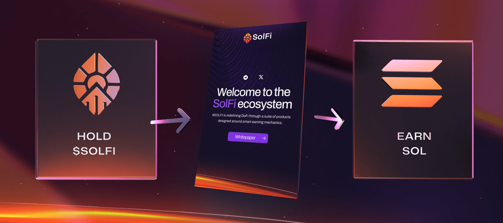

# 💰 Dividends

### What are dividends?
25% of all SOL deposited for printing is contributed to the dividend pool. Dividends are a fundamental part of the $SOLFI ecosystem, offering a passive income stream of SOL to our members that are holding $SOLFI.

### How can I earn?

By holding $SOLFI and staking you can earn SOL. Your exact earnings depends on how long you have held and staked your coins as well as the total amount you have versus what is already in the staking pool.

### How the dividend system works

1. Continuously stimulated by new users printing $SOLFI. Each time a user engages in the printing process, 25% of the SOL is contributed to the dividend pool.
2. Earn SOL, By holding and staking your $SOLFI tokens, you become eligible to earn SOL dividends.

### Benefits to the $SOLFI ecosystem

1. Provides a passive income for holding $SOLFI
2. Encourages holding and staking which increases the stability and growth of the token overtime
3. Long term sustainability. Dividends leverage the continuous influx of new deposits to reward token holders in SOL.